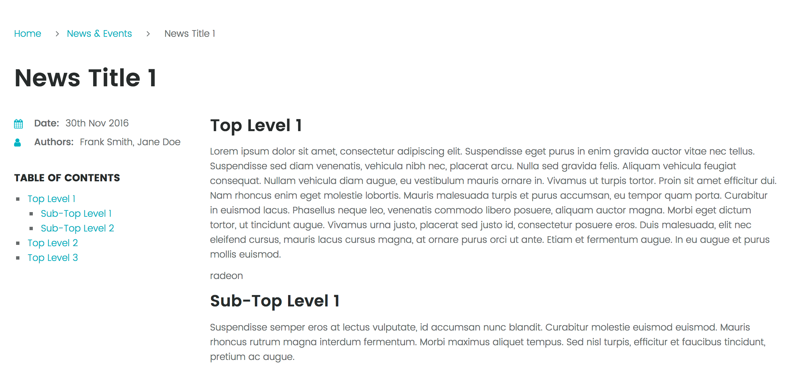

# Page Toc Plugin

The **Page Toc** Plugin is for [Grav CMS](http://github.com/getgrav/grav) that generates a table of contents from a page's HTML header tags.



## Installation

Installing the Page Toc plugin can be done in one of two ways. The GPM (Grav Package Manager) installation method enables you to quickly and easily install the plugin with a simple terminal command, while the manual method enables you to do so via a zip file.

### GPM Installation (Preferred)

The simplest way to install this plugin is via the [Grav Package Manager (GPM)](http://learn.getgrav.org/advanced/grav-gpm) through your system's terminal (also called the command line).  From the root of your Grav install type:

    bin/gpm install page-toc

This will install the Page Toc plugin into your `/user/plugins` directory within Grav. Its files can be found under `/your/site/grav/user/plugins/page-toc`.

### Manual Installation

To install this plugin, just download the zip version of this repository and unzip it under `/your/site/grav/user/plugins`. Then, rename the folder to `page-toc`. You can find these files on [GitHub](https://github.com/team-grav/grav-plugin-page-toc) or via [GetGrav.org](http://getgrav.org/downloads/plugins#extras).

You should now have all the plugin files under

    /your/site/grav/user/plugins/page-toc
	
## Configuration

Before configuring this plugin, you should copy the `user/plugins/page-toc/page-toc.yaml` to `user/config/plugins/page-toc.yaml` and only edit that copy.

Here is the default configuration and an explanation of available options:

```yaml
enabled: true     # Plugin enabled
active: true      # TOC processed by default for all page
start: 1          # Start header tag level (1 = h1)
end: 6            # End header tag level (61 = h6)
```

By default, The plugin is 'active' and will add header id attributes anchors for each header level found in a page.  You can set `active: false` and then activate on a page basis by adding this to the page frontmatter:

```yaml
page-toc:
  active: true
```

You can also configure which header tags to start and end on when building the id attribute anchors by changing the `start` and `end` values. This can also be done on a per-page basis.

## Usage

When the plugin is `active` it will add anchors to the header tags of the page content as configured.  Then all you need to do is to add your **table of contents** list in your Twig template with the provided `toc()` Twig function:

For example:

```twig
% if config.get('plugins.page-toc.active') or attribute(page.header, 'page-toc').active %}
<div class="page-toc">
    <h4>Table of Contents</h4>
    {{ toc(content) }}
</div>

```

## Credits

The majority of this plugin's functionality is provided by the [PHP TOC Generator](https://github.com/caseyamcl/toc) library by [Casey McLaughlin](https://github.com/caseyamcl). So Thanks for making this a trivial plugin for Grav!


